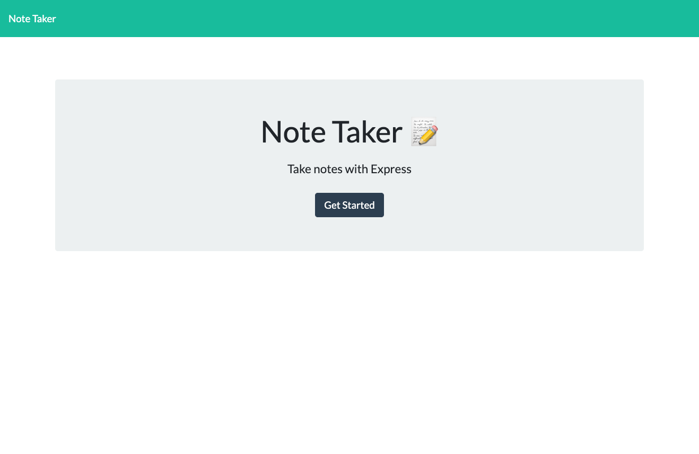
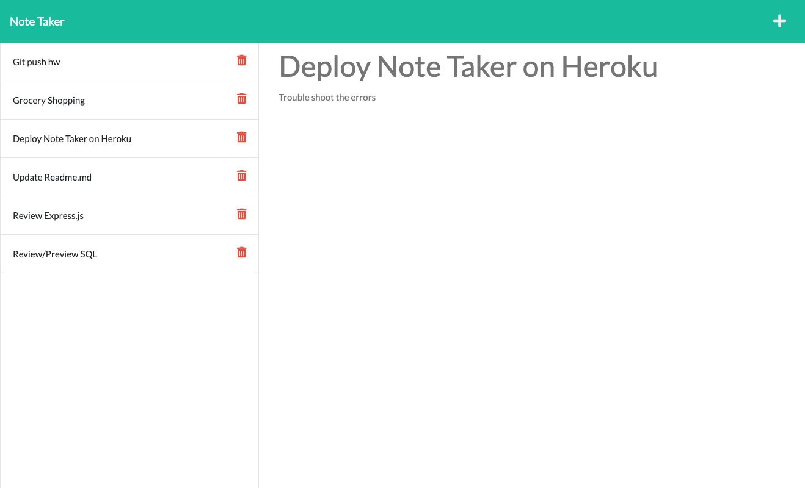

# Note Taker 📝 

## Table of Contents

- [Table of Contents](#table-of-contents)
- [Description](#description)
- [Screenshot for generated webpage](#screenshot-for-generated-webpage)
- [Heroku Deployment](#heroku-deployment)
- [Questions](#questions)

## Description 
- As a manager, he/she wants to generate a webpage that displays my team's basic info. So that he/she can have quick access to their emails and GitHub profiles. 
- This Node.js command-line application that takes in information about employees on a software engineering team, then generates an HTML webpage that displays summaries for each person. 

## Screenshot for generated webpage
### Home page

### Notes Page

## Heroku Deployment
- [Link for note taker live on Heroku](https://note-taker-by-elena.herokuapp.com/)

## Questions
- For more projects, please visit my [GitHub](https://github.com/elenaliu0415). 
- Please feel free to contact me at elenaliu0415@gmail.com